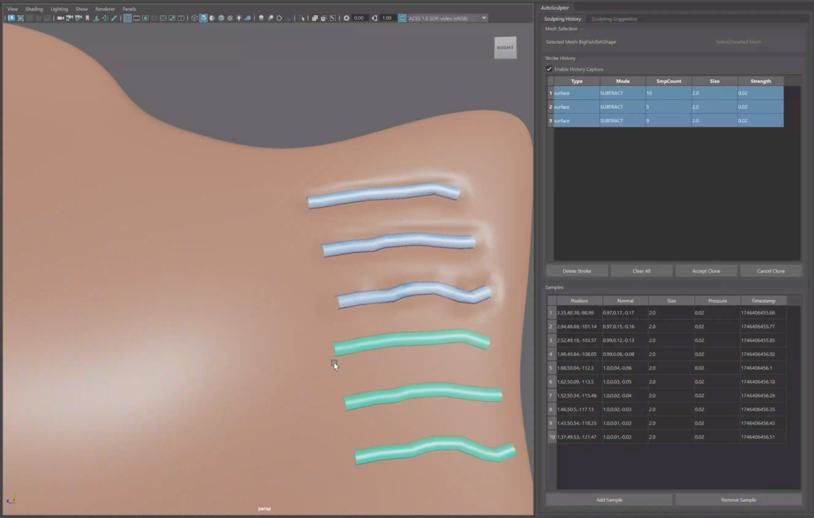

# AutoSculptor

AutoSculptor is a Maya plugin designed to assist 3D artists during the digital sculpting process by providing intelligent autocomplete suggestions and workflow enhancement tools. It is based on the research paper "Autocomplete 3D Sculpting" by Mengqi Peng, Jun Xing, and Li-Yi Wei.

The plugin silently records and analyzes the user's sculpting workflow, predicting future actions to reduce manual labor and potentially improve output quality for repetitive structures. Users retain full artistic control, with the ability to accept, ignore, or modify suggestions.

## Features

*   **Autocomplete Sculpting:**
    *   **Smart Suggestions:** As you sculpt, the system provides real-time visual hints for subsequent strokes based on your past actions and workflow patterns.
    *   **Contextual Awareness:** Suggestions are adapted to the local geometry (surface normal, curvature) and your sculpting history.
    *   **User Control:** Easily accept all suggestions, accept a specific suggestion, or ignore them and continue sculpting manually.
*   **Workflow Cloning:**
    *   Select a sequence of previously sculpted strokes (the "source").
    *   Select a target anchor point using Maya's vertex selection tool.
    *   The system intelligently transfers and adapts the source workflow to the new location and orientation.
*   **History Management:**
    *   **Stroke Capture:** Automatically records sculpting operations as a sequence of strokes.
    *   **Contextual Analysis:** Users can define a "context" of specific past strokes for more targeted suggestions and improve synthesis speed, or use the full history.
    *   **Visualization:** Selected history strokes are visualized directly on the mesh.
*   **Maya Integration:**
    *   **Real-time Operation:** Works within the Maya sculpting environment.
    *   **Standard Sculpt Tools:** Uses Maya's existing sculpting tools for input.
    *   **UI Panel:** Provides a comprehensive, dockable UI for managing history, suggestions, and plugin settings.
*   **Hotkeys:**
    *   Toggle Capture: `Ctrl + Alt + X`
    *   Toggle Suggestions: `Ctrl + Alt + D`
    *   Accept Selected Suggestion: `Ctrl + Alt + A`
    *   Accept All Suggestions: `Ctrl + Alt + Shift + A`
    *   Reject Selected Suggestion: `Ctrl + Alt + Z`

## Installation
***A Note On Compatibility**: This plugin is specifically developed and tested for **Maya 2025**. Maya 2025 uses a Python version compatible with PySide6, which this plugin relies on for its UI.*
**Earlier Maya versions using PySide2 are not supported.**

1.  **Dependencies:**
    Ensure you have Python 3.x installed with the following packages. It's recommended to install these into Maya's Python environment to ensure they are accessible.
    *   `numpy`
    *   `scipy`
    *   `pynput` (for mouse event capture if using the direct mouse listener for stroke segmentation)
    *   `potpourri3d` (for geodesic distance calculations)
    *   `PySide6` (should be available in modern Maya versions)
    *   `scikit-learn` (if PCA is used for stroke sampling)

    You can typically install these using pip, for example:
    `mayapy -m pip install numpy scipy pynput potpourri3d scikit-learn`, where `mayapy` is the Python binary bundled with your Maya installation.

2.  **Plugin Installation:**
	This repo contains a one-click installation script, `scripts/install_maya_plugin.py`. To install the plugin using the script:
	*	Linux and Mac OS X: `python3 scripts/install_maya_plugin.py`
	*	Windows: `python scripts\install_maya_plugin.py`  

	If the installation script fails, try installing the plugin manually: 
    *   Copy the `autosculptor` project directory (containing `analysis/`, `core/`, `maya/`, `suggestions/`, `ui/`, `utils/`) to `scripts/` (create the directory if it does not exist) in your Maya plugin directory.
	Common locations include: 
        *   Linux: `$HOME/maya/<version>`
        *   Mac OS X: `$HOME/Library/Preferences/Autodesk/maya/<version>`
		*	Windows: `\Users\<username>\Documents\maya\<version>`

    *   Alternatively, add the parent directory of your `autosculptor` checkout to the `MAYA_PLUG_IN_PATH` environment variable.
	*	Copy the plugin entry file `autosculptor/maya/plugin.py` to `plug-ins/` (create the directory if it does not exist) in your Maya plugin directory. You may want to rename `plugin.py` to something more differentiable, such as `autosculptor.py`.

3.  **Load Plugin in Maya:**
    *   Open Maya.
    *   Go to `Windows > Settings/Preferences > Plug-in Manager`.
    *   Find `autosculptor.py` (or the name you've given the plugin file from `maya/plugin.py` if different) in the list.
    *   Check the "Loaded" box. Check "Auto load" if you would like it to load on startup.
    *   If you don't see it, ensure the path is correct and click "Refresh".

## Usage

1.  **Open the AutoSculptor UI:**
    *   Once the plugin is loaded, a menu "AutoSculptor" should appear in Maya's main menu bar.
    *   Click `AutoSculptor > Open UI Panel`.

2.  **Select Target Mesh:**
    *   Select the mesh you want to sculpt in the Maya viewport. 
    *   In the "Sculpting History" tab of the AutoSculptor panel, click the "Select/Deselect Mesh" button. The UI will update to show the selected mesh.

3.  **Enable History Capture:**
    *   Check the "Enable History Capture" checkbox in the "Sculpting History" tab.
    *   This activates the system to start recording your sculpting actions. The "Select/Deselect Mesh" button will be disabled while capture is active.

4.  **Sculpt Manually:**
    *   Use Maya's standard sculpting tools (e.g., Sculpt, Grab, Smooth).
    *   The system captures mouse events (if `pynput` listener is active) or infers strokes from mesh changes (if `scriptJob` is active) to build a history of `Stroke` objects.
    *   Each stroke is composed of multiple `Sample` points, capturing position, normal, brush size, pressure, etc.

5.  **Observe Suggestions (Predictions):**
    *   In the "Sculpting Suggestion" tab, check "Enable Prediction".
    *   As you complete strokes, the system will analyze your workflow and generate suggestions (visualized as yellow tubes) on the mesh for potential next strokes.
    *   The list of suggested strokes will also appear in the "Stroke Predictions" table in the UI.
    *   **Auto Camera:** Check "Enable Auto Camera" to have the Maya camera automatically adjust to better frame the current primary suggestion.

6.  **Interact with Suggestions:**
    *   **Visualize:** Suggestions selected from the table are visualized as translucent tubes.
    *   **Accept Selected:** Select a suggestion in the "Stroke Predictions" list and click "Accept Selected". The suggested stroke will be applied to the mesh and added to your history.
    *   **Accept All:** Click "Accept All" to apply all current suggestions.
    *   **Reject Selected:** Select a suggestion and click "Reject Selected" to remove it from the current set of suggestions.
    *   **Ignore:** Simply continue sculpting. New suggestions will be generated based on your subsequent actions.

7.  **Manage Stroke History & Context:**
    *   **View History:** The "Stroke History" table displays all captured strokes. Selecting a stroke here will:
        *   Display its individual samples in the "Samples" table below it.
        *   Visualize the selected history stroke(s) as blue tubes on the mesh.
    *   **Set Context:** Select one or more strokes in the history list and click "Set Context". Future suggestions will be primarily based on this defined context rather than the entire history. Context strokes are highlighted in the UI.
    *   **Clear Context:** Click "Clear Context" to revert to using the full history for suggestions.
    *   **Delete Stroke:** Select a stroke in the history and click "Delete Stroke" to remove it.
    *   **Clear All:** Removes all strokes from the history. This operation does not revert the mesh displacements.

8.  **Workflow Cloning:**
    *   Ensure "Enable History Capture" is active.
    *   Select one or more strokes from the "Stroke History" table that you wish to clone.
    *   Click the "Clone Stroke" button.
    *   A message will appear in the viewport, prompting you to select a target vertex on the mesh to anchor the clone. Maya's selection will switch to component (vertex) selection.
    *   Click a vertex on your mesh.
    *   A preview of the cloned workflow (in cyan) will be visualized.
    *   The "Clone Stroke" button will change to "Accept Clone". Click it to apply the cloned strokes to the mesh and add them to your history.
    *   Click "Cancel Clone" at any time during the target selection or preview to abort.

9.  **Disable Capture / Close:**
    *   Uncheck "Enable History Capture" to stop recording.
    *   Close the AutoSculptor UI panel when done.

## Technical Details

### Core Concepts (from the paper)

*   **Workflow over Static Geometry:** The system analyzes *how* a model is authored (dynamic workflows) in addition to *what* it is shaped like (static geometry).
*   **Repetition in Workflows:** Assumes that sculpting, especially for detailed or organic models, often involves repetitive sequences of operations.
*   **Parameterization:** Brush strokes are parameterized in a local coordinate frame relative to the evolving 3D surface or in freeform space to make them comparable and transferable.
    *   **Surface Strokes:** Parameterized by `(ts, ds)` - arc length along the stroke path and geodesic distance perpendicular to it.
    *   **Freeform Strokes:** Parameterized by `(xs, ys, zs)` in a local 3D frame relative to the stroke path and camera view.
*   **Context Factorization:** The system factors out contextual parts of workflow positions during analysis (e.g., using local parameterizations) and factors them back in during synthesis (suggestion generation, cloning).
*   **Synthesis as Optimization:** Suggestion generation is framed as an energy minimization problem, finding the most probable next stroke based on similarity to past workflow segments and optional user constraints.

### Data Structures (`core/data_structures.py`)

*   **`Sample`:** Represents a single point along a brush stroke.
    *   `position`: 3D world-space coordinates (NumPy array).
    *   `normal`: Surface normal at the sample point (NumPy array).
    *   `size`: Brush size at this sample.
    *   `pressure`: Pen pressure.
    *   `timestamp`: Time of capture.
    *   `curvature`: Estimated surface curvature.
    *   `ts, ds`: Normalized parameters for surface strokes.
    *   `xs, ys, zs`: Normalized parameters for freeform strokes.
    *   `camera_lookat`: Camera look-at vector at the time of sampling.
*   **`Stroke`:** A sequence of `Sample` objects representing a single continuous sculpting action.
    *   `samples`: List of `Sample` objects.
    *   `stroke_type`: "surface" or "freeform".
    *   `brush_size, brush_strength, brush_mode, brush_falloff`: Properties of the brush used.
    *   `start_time, end_time`: Timestamps for the stroke.
*   **`Workflow`:** A sequence of `Stroke` objects representing the entire sculpting session or a selected context.
    *   `strokes`: List of `Stroke` objects.
    *   `active_context_indices`: Optional list of indices defining a subset of strokes for focused analysis.

### Workflow Analysis & Synthesis (`analysis/`)

*   **Parameterization (`analysis/parameterization.py`):**
    *   `StrokeParameterizer`: Converts raw 3D sample data into normalized `(ts, ds)` or `(xs, ys, zs)` parameters and vice-versa.
    *   Uses `CachedGeodesicCalculator` (which wraps `potpourri3d`) for geodesic distances on the mesh surface.
*   **Similarity (`analysis/similarity.py`):**
    *   Defines how to measure the difference (or similarity) between samples and strokes.
    *   `calculate_sample_differential`: Computes differences in parameterized position, appearance (normal, curvature), and temporal aspects.
    *   `calculate_stroke_sample_match_distance`: Uses Hungarian Matching algorithm (`scipy.optimize.linear_sum_assignment`) to find optimal matching between samples of two strokes and computes an aggregate distance.
    *   `calculate_neighborhood_distance`: Extends stroke distance to consider neighboring strokes in the workflow, providing a more robust similarity measure.
*   **Suggestion Generation (`analysis/synthesis.py`):**
    *   `StrokeSynthesizer`: Core class for generating new stroke suggestions.
    *   **Initialization:** Generates initial candidate suggestions by finding past workflow segments (bi, bi+1) similar to the current segment (b', bo_candidate). The differential u(bi+1, bi) is applied to b' to form bo_candidate.
    *   **Search & Optimization:**
        *   An energy function (Eq. 11 from paper) balances neighborhood similarity and optional user constraints.
        *   Iteratively refines candidate strokes to minimize this energy.
        *   The similarity between target stroke bo and history stroke bi includes comparing their central characteristics and the relationships with their respective neighboring strokes.
    *   **Cloning:**
        *   The `clone_workflow` method takes source strokes, anchor points/normals, and a target anchor.
        *   It calculates a transformation (rotation + translation) from source to target anchor.
        *   Each sample in the source strokes is transformed and projected onto the target mesh. For surface strokes, this involves careful handling of local surface parameterization.

### Maya Integration (`maya/`)

*   **Event & Mesh Change Capture (`maya/capture.py`):**
    *   `SculptCapture`: The central class managing the interaction between Maya and the AutoSculptor backend.
    *   **Stroke Inference:**
        *   Originally uses a `scriptJob` listening to `idle` events to detect mesh changes (`process_mesh_changes`). It compares current vertex positions to previous ones and extracts the principal directions using PCA.
        *   Currently, it uses `pynput` for direct mouse event listening (`on_mouse_click`, `on_mouse_move`) to define stroke start/end and capture sample points during mouse drags. This provides more explicit stroke segmentation and more accurate capture results.
    *   **Tool & Brush Info:** Detects the active Maya sculpt tool and its parameters (size, strength) using `cmds.currentCtx()` and `cmds.sculptMeshCacheCtx()`.
    *   **Camera Info:** Uses `maya.api.OpenMaya.MFnCamera` to get camera position and orientation for parameterization and auto-camera features.
    *   **Suggestion Application:** When a suggestion is accepted, it instantiates an appropriate `SurfaceBrush` or `FreeformBrush` and calls its `apply_to_mesh` method for each sample in the suggested stroke. This modifies the `MeshData` via the `MeshInterface`.
*   **Maya Plugin (`maya/plugin.py`):**
    *   Registers the plugin with Maya and creates the "AutoSculptor" menu.
    *   Initializes and shows the `AutoSculptorToolWindow`.
*   **Mesh Interface (`core/mesh_interface.py`):**
    *   `MeshData`: A wrapper to hold vertex, normal, and face data, along with Maya-specific DAG paths and `MFnMesh` objects.
    *   `MeshInterface`: Static methods to interact with Maya meshes:
        *   `get_mesh_data()`: Fetches geometry data from a named Maya mesh.
        *   `update_mesh_vertices()`: Pushes modified vertex data back to the Maya mesh.
        *   `find_closest_point()`: Uses `MFnMesh.getClosestPointAndNormal()` for projecting points onto the surface.
*   **UI (`ui/ui.py`):**
    *   Built with PySide6.
    *   `AutoSculptorToolWindow`: The main dockable window containing tabs.
    *   `SculptingPanel`: Tab for history display, capture control, context management, and cloning.
    *   `SuggestionPanel`: Tab for suggestion display, prediction control, and suggestion interaction.
    *   Connects UI elements (buttons, checkboxes) to methods in `SculptCapture`.
*   **Visualization (`suggestions/visualization.py`):**
    *   `StrokeVisualizer`: Creates Maya geometry to display historical strokes, suggestions, or clone previews.
    *   Manages shaders and display layers for visualization.

### Key Modules Overview

*   `analysis/`: Algorithms for parameterization, similarity calculation, and stroke synthesis.
*   `core/`: Fundamental data structures (`Sample`, `Stroke`, `Workflow`), brush abstractions, and Maya mesh interface.
*   `maya/`: Maya-specific integration code, including event capture, plugin commands, and utilities.
*   `suggestions/`: Visualization of suggested strokes.
*   `ui/`: PySide6 user interface for interacting with the plugin.
*   `utils/`: General utility functions.

## Dependencies

*   **Maya:** Version 2025 or newer (due to PySide6 and Python 3 usage).
*   **Python 3.x** (as bundled with Maya)
*   **NumPy:** For numerical operations.
*   **SciPy:** For optimization algorithms (e.g., Hungarian algorithm for sample matching).
*   **pynput:** For mouse event capture.
*   **potpourri3d:** For efficient geodesic distance calculations on meshes.
*   **scikit-learn:** Optional, required if PCA is used instead of `pynput` in stroke sampling/analysis.

## Limitations & Future Work

*   **Non-Repetitive Operations:** The current system excels at repetitive tasks. Initial shape formation or highly unique sculpting actions receive less assistance.
*   **Computational Cost:** Real-time analysis and suggestion generation for very complex histories or meshes can be computationally intensive. Performance optimizations may be ongoing.
*   **Complex Feature Interactions:** Handling intricate geometric interactions or predicting topological changes remains challenging.
*   **User Intent Ambiguity:** Interpreting user intent perfectly from a limited history is difficult.
*   **Future Work (from paper):**
    *   Integration with other data-driven or procedural modeling methods for initial shape formation.
    *   More advanced automatic camera controls.
    *   Exploring other geometry and topology features for better workflow-shape correlation.
    *   Machine learning approaches to train the prediction model based on user feedback (accept/reject/modify).
    *   Extension to multi-user (collaborative) sculpting or multi-session stylization.
    *   Support for VR sculpting environments.

## Acknowledgements

This plugin is an implementation based on the concepts presented in the following research paper:

Mengqi Peng, Jun Xing, & Li-Yi Wei. (2017). Autocomplete 3D Sculpting. https://doi.org/10.48550/arXiv.1703.10405.

## License
MIT